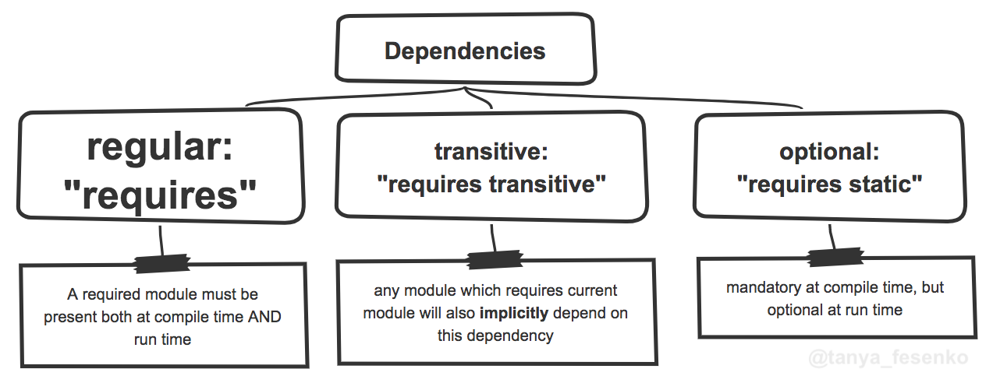
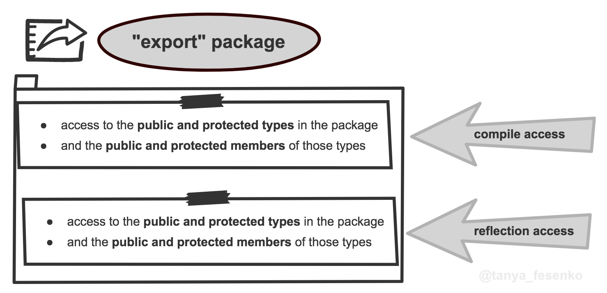
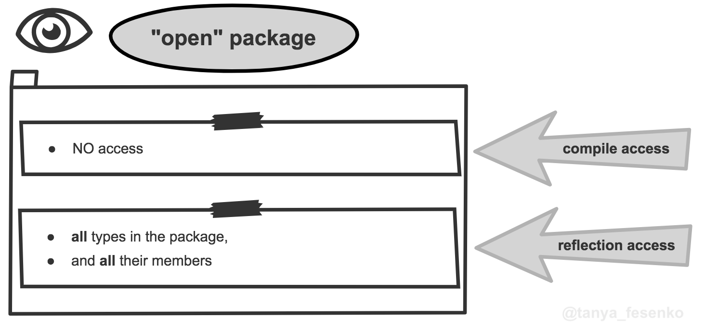
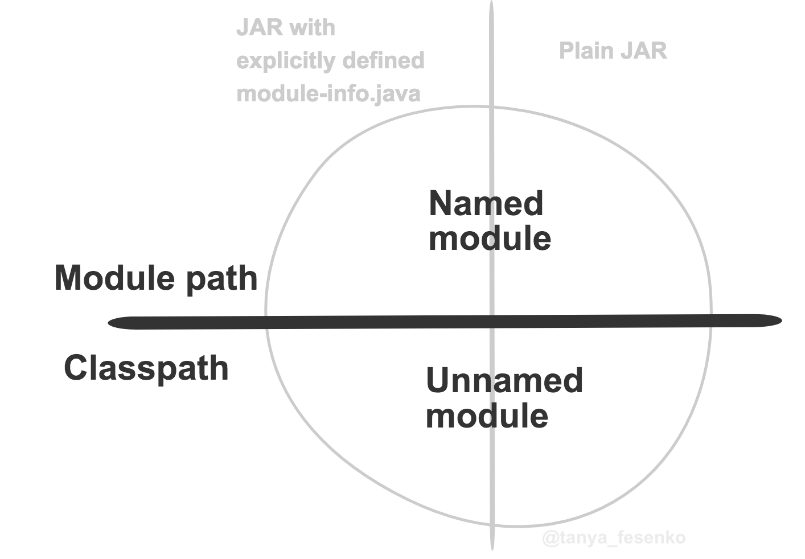
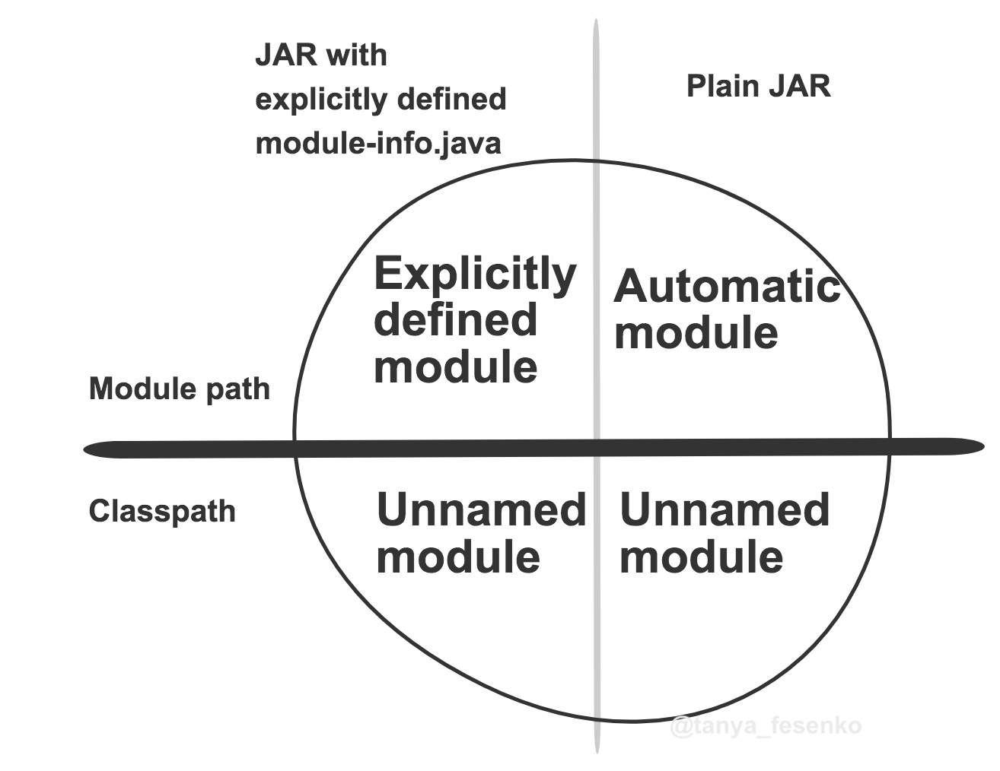

Java Modules (JPMS) Cheat Sheet
========

Project Jigsaw, The Java Platform Module System (JPMS), Modularity, JSR 277, JSR 376... These are the names of one of the most significant features of Java 9. Modularity reduces the complexity of the system by providing:
* Explicit dependencies
* Clear interface
* Strong encapsulation
	
Modularity is also arguably one of the terrifying Java features of all times.  Despite these numerous benefits, proper modules are still rare species in the Java world. 

The purpose of this cheat sheet is to show that modules in Java are friendly to us, developers, and easy to use. The [Module Declaration (module-info.java)](#module-declaration-module-infojava) section explains how to define modules. The [Module Path vs Class-Path](#module-path-vs-class-path) section will be helpful for people migrating existing non-modular applications to JPMS. 

Table of Contents
-----------------
[FAQ](#faq)  

[Module Declaration (module-info.java)](#module-declaration-module-infojava)
  * [Module Name and Minimal Module Declaration](#module-name-and-minimal-module-declaration)
  * [Dependencies](#modules-dependencies)
  * [API](#modules-api)
  * Other Stuff: [Services](#optional-services-for-di), [Annotations](#annotations-in-module-declarations), and [Formal grammar of the module declaration file](#formal-grammar-of-the-module-declaration-file)

[Module Path vs Class Path](#module-path-vs-class-path)
  * [Types of Modules: Named and Unnamed](#types-of-modules-named-and-unnamed)
  * [Explicit Modules](#explicit-modules)
  * [Automatic Modules](#automatic-modules)
  * [Unnamed Module](#unnamed-module)

[Resources](#resources)

FAQ
========
Here are some of important questions about support of old-style non-modular jar in Java 9+. It's better than what you think! :star2:

### Will my plain old jar (without a module declaration) work? 
...and...
### Will my modularized jar work with dependencies which are not modularized yet? 
YES! and YES! 
But... if...:ballot_box_with_check:it's Java 9 friendly, *e.g.*, it doesn't use private API or split packages.  

Read more:   
:page_facing_up: Java 9 Migration Guide: The Seven Most Common Challenges: https://blog.codefx.org/java/java-9-migration-guide/  

In JPMS, you can convert existing non-modular jars into:
* **Unnamed** modules, when passed on classpath;
* Or, **automatic** modules, when passed on module path.  
See [Module Path vs Class Path](#module-path-vs-class-path).  


Module Declaration (`module-info.java`)
========
A module declaration is a file which defines the dependency graph: 
* Dependencies: Which other modules this module depends on;
* API: which parts of this module other modules can use: at compile time or at runtime.

To create a module declaration:  
:heavy_check_mark: Create a file named `module-info.java`  
:heavy_check_mark: By convention, it should be placed at the root source folder, e.g., next to the `com` or `org` folders.  


Module Name and Minimal Module Declaration
--------
A minimal module declaration defines its name:
```java
module com.mycompany.myproject {
}
```
<table>
  <tr>
    <td> :bomb::boom: The module name must be <b>globally unique</b> - the name conflicts are prohibited. A recommended practice is to use a <b>reverse-domain-name pattern</b></td>
  </tr>
</table>

Module's Dependencies
--------
Dependencies are other modules this module needs for its work - it **requires** these modules.


```java
module com.mycompany.myproject { // the module name should be unique

   // dependency on `com.example.foo.bar` which must be present both at compile time AND runtime
   requires com.example.foo.bar;
   
   // transitive dependency: any module which requires current module will also *implicitly* depend on this dependency
   requires transitive com.kitties.bar;
   
   // optional dependency is mandatory at compile time, but optional at runtime 
   requires static com.owls.foo;
}
```
Read more:   
:page_facing_up: Optional Dependencies: https://blog.codefx.org/java/module-system-optional-dependencies/    
:page_facing_up: Transitive Dependencies: https://blog.codefx.org/java/implied-readability/    


Module's API
--------
In pre-Java 9 world any public class was available everywhere and could be used by any other class. The "internal" packages were not in fact internal. With Java 9, module's contents are not available to the external classes by default; one must explicitly define what the module exposes to outside world so that other modules could use it either in compile time or via reflection. Module's API is now expressly specified in the module's declaration.

<table>
	<tbody>
		<tr>
			<th colspan="2" rowspan="2"> </th>
   <th colspan="2"><h3>Compile Access</h3></th>
   <th colspan="2"><h3>Reflection Access</h3></th>
		</tr>
		<tr>
			<th><h3>What</h3></th>
   <th><h3>By Whom</h3></th>
 		<th><h3>What</h3></th>
   <th><h3>By Whom</h3></th>
		</tr>  
  <tr>
			<th rowspan="2"><h3>Export Package</h3></th>
			<th><h3>Unqualified</h3></th>
			<td rowspan="2"><ul><li><b>Public and protected types</b> in the package</li>
<li><b>Public and protected members</b> of those types</li><ul></td>
			<td>All Code</td>
			<td rowspan="2"><ul><li><b>Public and protected types</b> in the package</li>
<li><b>Public and protected members</b> of those types</li><ul></td>
			<td>All Code</td>
		</tr>
		<tr>
			<th><h3>Qualified</h3></th>
			<td>Modules from the "to" clause</td>
			<td>Modules from the "to" clause</td>
		</tr>
  <tr>
			<th rowspan="2"><h3>Open Package</h3></th>
			<th><h3>Unqualified</h3></th>
			<td rowspan="2">NO access</td>
			<td>All Code</td>
			<td rowspan="2"><ul><li><b>All</b> types in the package</li>
<li>And <b>all</b> their members</li><ul></td>
			<td>All Code</td>
		</tr>
		<tr>
			<th><h3>Qualified</h3></th>
			<td>Modules from the "to" clause</td>
			<td>Modules from the "to" clause</td>
		</tr>  
 </tbody>
</table>


### How to export or open a package
A package can be exported or opened in
* :smiley: Module declaration (`module-info.java` file). It's a recommended approach when you have control over this file.
* :worried: Or, as a command line option, if you have no other choice.
<table>
	<tbody>
		<tr>
			<th colspan="2"> </th>
   <th><h3>Module Descriptor</h3></th>
   <th><h3>Java Command Line Options</h3></th>
		</tr>
   <tr>
			<th rowspan="2"><h3>Export Package</h3></th>
			<th><h3>Unqualified</h3></th>
	   		<td><code>exports <em>packageName</em></code></td>
			<td>n/a</td>
		</tr>
		<tr>
			<th><h3>Qualified</h3></th>
			<td><code>exports <em>packageName</em> to <em>targetModule</em></code>
				<br/><br/><em><strike>ALL-UNNAMED</strike></em> is NOT allowed in the descriptor</td>
			<td><code>--add-exports <em>sourceModule</em><b>/</b><em>packageName</em><b>=</b><em>targetModule(,targetModule)*</em></code><br/></br/>
	The target-module can be <em>ALL-UNNAMED</em> to export to all unnamed modules</td>
		</tr>
   <tr>
			<th rowspan="2"><h3>Open Package</h3></th>
			<th><h3>Unqualified</h3></th>
			<td><code>opens <em>packageName</em></code></td>
			<td>n/a</td>
		</tr>
		<tr>
			<th><h3>Qualified</h3></th>
			<td><code>opens <em>packageName</em> to <em>targetModule</em></code></td>
			<td><code>--add-opens <em>sourceModule</em><b>/</b><em>packageName</em><b>=</b><em>targetModule(,targetModule)*</em></code></td>
		</tr>
 </tbody>
</table>

Read more:   
:page_facing_up: Java Platform, Standard Edition Tools Reference > Main Tools to Create and Build Applications > java: https://docs.oracle.com/javase/9/tools/java.htm#GUID-3B1CE181-CD30-4178-9602-230B800D4FAE__GUID-AC22D7B8-E3C4-4554-AE49-A62C9421AA7C   
:page_facing_up: Five Command Line Options To Hack The Java 9 Module System: https://blog.codefx.org/java/five-command-line-options-to-hack-the-java-9-module-system/   


### Exported Packages

The `exports` directive defines what this module exposes to other modules at runtime and compile time.


```java
module com.mycompany.myproject { // the module name should be unique

   // unqualified export => grants access to ALL other modules
   exports com.mycompany.myproject.foo;
   
   exports com.mycompany.myproject.foo.internal
       // having a "to" clause means that this is a **qualified export** => exports the package only to the friends of the current module - the modules specified in the `to` clause
       to com.example.x;
   exports com.mycompany.myproject.bar.internal to com.example.y, com.example.z;
          
}   
```

### Packages Open for Reflection
The `opens` directive opens the module to the **outside** modules for the reflection. It's usually useful when using reflection-based frameworks such as Spring or Guice;

<table>
  <tr>
    <td>:pencil2: As for the code from <b>inside</b> of the current module, it can still reflectively access all types and members from the module regardless whether they were opened or not</td>
  </tr>
</table>


```java
module com.mycompany.myproject { // the module name should be unique
   
   // `opens` the package for reflection to ALL other modules
   // * compile time: no access at all 
   // * runtime: to all types, including private types, and all their members, including private ones
   opens com.mycompany.myproject.ollie;
   
   // a qualified `opens` directive - only modules from the `to` cause can access this package at runtime
   opens com.mycompany.myproject.ollie.internal to org.anothercompany.coolframework;
   
   // Also see a section about the open modules - a module which opens ALL its packages
}   
```
#### Shortcut: an **open** module
An open module `opens` all its packages. To define it, add the `open` modifier before the `module`:
```java
open module com.mycompany.myproject {
}   
```

Advanced: Services for DI
--------
Services implemented with use of `ServiceLoader` existed in Java well before Java 9. Their goal is to do decouple the interface and its implementation(s). Now, in Java 9, we can declare services and their usages in the `module-info.java`:
Service consumer:
```java
module com.mycompany.serviceconsumer {
   // Use an existing service. The implementation can be accessed in code by using the ServiceLoader
   uses com.example.foo.ServiceInterface;
}   
```
Service provider:
```java
module com.mycompany.service {
   // Register a new service implementation for com.example.foo.ServiceInterface
   provides com.example.foo.ServiceInterface 
     with com.example.foo.ServiceImpl;
}   
```

<table>
  <tr>
    <td> :pencil2: Service consumer and service provider can also be defined in the same module.</td>
  </tr>
</table>
Read more:    
:page_facing_up: https://dzone.com/articles/java-9-kickoff-project-jigsaw-and-serviceloader-part-2 

Advanced: Annotations in Module Declarations
--------
Module declarations can also have annotations, *e.g.*, the `@Deprecated` annotations:
```
/**
 * This module was replaced by a new module performing the same job much better!
 * @deprecated use {@link com.mycompany.newcoolmodule} instead.  
 */
@Deprecated
module com.mycompany.oldmodule {}
```

Advanced: The formal grammar of the module declaration file
--------
OK, open modules, annotations... What else? :coffee: A structure of a module declaration may seem too complicated. But it's not! Just see the grammar for module files (taken from section 7.7 of [Java 9 Language Specification](http://cr.openjdk.java.net/~mr/jigsaw/spec/java-se-9-jls-diffs.pdf)):
```yaml
ModuleDeclaration:
  {Annotation} [open] module Identifier{.Identifier}
  { {ModuleDirective} }

ModuleDirective:
  requires {RequiresModifier} ModuleName ;
  exports PackageName [to ModuleName {, ModuleName}] ; 
  opens PackageName [to ModuleName {, ModuleName}] ; 
  uses TypeName ;
  provides TypeName with TypeName {, TypeName} ;

RequiresModifier:
  (one of)
  transitive static
  
ModuleName:
  Identifier{.Identifier}
```

Module Path vs Class Path
========

<table>
  <tr>
    <th> </th>
    <th><h3>Command line</h3></th>
    <th><h3>Modular JAR (JAR with a module-info.class)</h3></th>
    <th><h3>Plain JAR</h3></th>
  </tr>
  <tr>
    <th><h3>Module Path</h3></th>
    <td><ul><li><code>--module-path modulepath</code></li>
	    <li><code>-p modulepath</code></li></ul></td>
    <td><b>Explicitly defined</b> module</td>
    <td><b>Automatic</b> module</td>
  </tr>
  <tr>
    <th><h3>Classpath</h3></th>
    <td><ul><li><code>--class-path classpath</code></li>
	    <li><code>-classpath classpath</code></li>
	    <li><code>-cp classpath</code></li>
	    </ul></td>
    <td><b>Unnamed</b> module</td>
    <td><b>Unnamed</b> module</td>
  </tr>
</table>


You can mix module path and classpath!

Read more:  
:page_facing_up: Java Platform, Standard Edition Tools Reference > Main Tools to Create and Build Applications > java: https://docs.oracle.com/javase/9/tools/java.htm#GUID-3B1CE181-CD30-4178-9602-230B800D4FAE__BABDJJFI


Types of Modules: Named and Unnamed
--------
As you can see from the table above:
* Everything on the module path, regardless whether it's a plain jar or a jar with a module-info, becomes a named module.
* Similarly, everything on the classpath, regardless whether it's a plain jar or a jar with a module-info, becomes an unnamed module.


In fact, there are three module types:
* Named:
  * Explicit
  * Automatic
* Unnamed 



Explicit Modules
--------
Explicit modules follow the rules for [Dependencies](#modules-dependencies) and [API](#modules-api) defined in its [Module Declaration (module-info.java)](#module-declaration-module-infojava)
	
Automatic Modules
--------
Automatic modules are plain JARs (no module descriptor) on the module path.
<table>
  <tr>
    <td> :pencil2: <b>reads</b> vs <b>requires</b></br>
	"Module1 reads Module2" means that Module1 can access types from Module2's exported packages.</br>
	A module that <em>requires</em> another module also <em>reads</em> the other module.</td>
  </tr>
</table>

As they don't have a `module-info.class`, this information will be calculated using the following rules:

* **Name**: `Automatic-Module-Name` from `MANIFEST.MF` if it's present. Derived from the JAR name otherwise. 
  * They can be referenced using this name;
  * See http://branchandbound.net/blog/java/2017/12/automatic-module-name/ for details;
  * For Eclipse plug-ins, see https://dev.eclipse.org/mhonarc/lists/cross-project-issues-dev/msg14888.html;
* **Dependencies**:
  * It `requires transitive` all other resolved modules;
  * Reads the [`unnamed` module](#unnamed-module);
* **API**:
  * Exports all its packages;
  * The module can be referenced in other modules' `module-info.java` using its calculated name. 

Unnamed Module
--------
Everything on the classpath becomes an unnamed module.
* ~**Name**~: No name;
* **Dependencies**:
  * Reads all other modules
  * Can read or open other`ALL-UNNAMED` in the [command line](#how-to-export-or-open-a-package)
* **API**:
  * Because it does not have a name, it cannot be referenced in module-info.java.
  * Readable only by [automatic modules](#automatic-modules)


Resources
========
:page_facing_up: Java Language Specification. Chapter 7. Packages and Modules. https://docs.oracle.com/javase/specs/jls/se9/html/jls-7.html  
:books::heavy_dollar_sign: The Java Module System  by Nicolai Parlog : https://www.manning.com/books/the-java-module-system  
<b>Disclaimer</b>: I was a manuscript reviewer of this book and, thus, got a free copy of it from Manning.  

:books::heavy_dollar_sign: Java 9 Modularity by Sander Mak, Paul Bakker: https://javamodularity.com/  
:page_facing_up: Understanding Java 9 Modules: https://www.oracle.com/corporate/features/understanding-java-9-modules.html  
:page_facing_up: Programming with Modularity and Project Jigsaw. A Tutorial Using the Latest Early Access Build https://www.infoq.com/articles/Latest-Project-Jigsaw-Usage-Tutorial  
:speaker: Sander Mak on the Java Module System: https://www.infoq.com/podcasts/Sander-Mak-module-system-Java9  
:movie_camera: Designing for Modularity with Java 9: https://www.youtube.com/watch?v=tamVhtV18dY  

Acknowledgments
=========
* Special thanks to [Vera Zvereva](https://www.linkedin.com/in/verazvereva) whose feedback was invaluable. 
* https://github.com/ajaxorg/ace/pull/3628 


